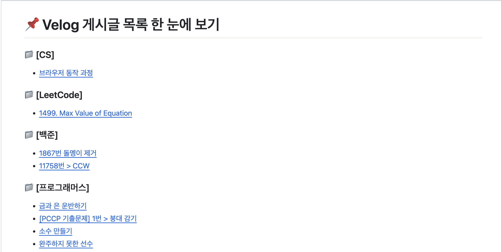

# Velog 🔁 Github

   
   

<h3 align=center>🌱 Velog 게시글을 깃허브로 모아보기 🌱</h3>

## 👋 Introduction
<h4> 🥲 Velog의 단점 - 지금까지 작성한 게시글 목록을 쭉 모아보기가 어렵다. </h4>

<h4> 😎 그럼 Velog로 작성한 게시글을 깃허브에 자동으로 정리될 수 있게 하자! 깃허브 잔디는 덤~ </h4>

 

### 기획 의도
옵시디언에 깃허브를 연동해 일정 시간 마다 레포지토리에 commit 하는 기능을 애용하고 있었다. 그러다 보니 블로그 포스트를 작성해도 옵시디언 처럼 commit 될 수 있다면 좋지 않을까? 생각이 들었다. 

그래서 그 유명한 백준허브처럼 Velog에서 출간하기 버튼을 누르면 깃허브에 바로 반영될 수 있으면 좋겠다 생각했지만...현실적으로 쉽지 않아 보였다.😭 

이거 말고도 해야할 게 많았기 때문에 결국 Github Actions로 정해진 기간마다 Velog 포스트를 깃허브에 저장하는 스크립트를 실행시키는 것으로 타협했다.

 

### 기능 설명
- Velog에서 게시글 정보를 불러와 **신규 게시글일 경우 `posts` 폴더에 추가**한다.
  - 깃허브에 저장되는 게시글 정보는 `원본 링크`와 `게시글을 마크다운으로 변환한 결과`이다.

- 만약 게시글 제목 앞부분에 `[]`이 포함될 경우 이것을 기준으로 하위 폴더를 구성한다. 
  - `[프로그래머스] 하노이의 탑`이란 제목의 게시글이 있다면 
  - `./posts/[프로그래머스]` 폴더 아래에 저장된다.

- posts 폴더 아래 README.md를 통해 각 하위 폴더 별로 어떤 게시글이 있는지 한 눈에 확인 가능하다.
  - 새로운 게시글이 추가될 때마다 업데이트된다.

 

### 사용 기술
  
> RSS를 사용해 Velog 포스트를 scraping & parsing 하는 작업이 필요했기 때문에 parsing 작업에 적합한 Python으로 스크립트를 작성  
> `feedparser` 라이브러리 활용해 RSS 파싱
  

> 스크립트 실행

 

---

### 🔧 에러 로그
- _The following actions uses node12 which is deprecated and will be forced to run on node16: actions/checkout@v2._
  - `checkout@v2`가 node12를 사용하는데 node12는 더이상 지원하지 않는 상황
  - 해결 방법
    - `checkout@v3`로 바꿔주면 된다.
  
- 블로그의 모든 게시글을 가져오지 못 하는 문제
  - Velog RSS로 한 번에 가져올 수 있는 게시글의 수가 총 20개로 제한되어 있는 것 같다.
  
- 불러온 게시글이 따로 수정되지 않는 문제
  - RSS로 불러온 게시글은 마크다운 문법으로 저장되는 것이 아닌 **HTML 문법으로 변환되어 문자열**로 저장된다. 
  - 따라서 수정하고 싶은 부분은 html로 작성해야 반영된다.

- posts/README.md 내부에 링크 적용 안 되는 문제
  - posts/README.md에 각 폴더 별 파일 목록을 출력하면서 바로 그 파일로 이동할 수 있는 링크를 넣어주고자 했다.
  - 하지만 파일 제목에 특수문자와 한글이 포함되서인지 링크가 먹히지 않았다. 
  - utf-8도 적용했는데 왜 안 되는지는 모르겠다.😭

  

---
### 🔗 참고 자료
- <a href="https://velog.io/@sooozi/velog%EC%99%80-github-%EC%97%B0%EB%8F%99-%EB%B2%A8%EB%A1%9C%EA%B7%B8-%EA%B8%80%EC%93%B0%EA%B3%A0-%EC%9E%94%EB%94%94%EC%8B%AC%EA%B8%B0" target="blank">velog와 github 연동 : 벨로그 글쓰고 잔디심기 🌱</a>
- <a href="https://feedparser.readthedocs.io/en/latest/common-rss-elements.html" target="blank">feedparser Documentation</a>